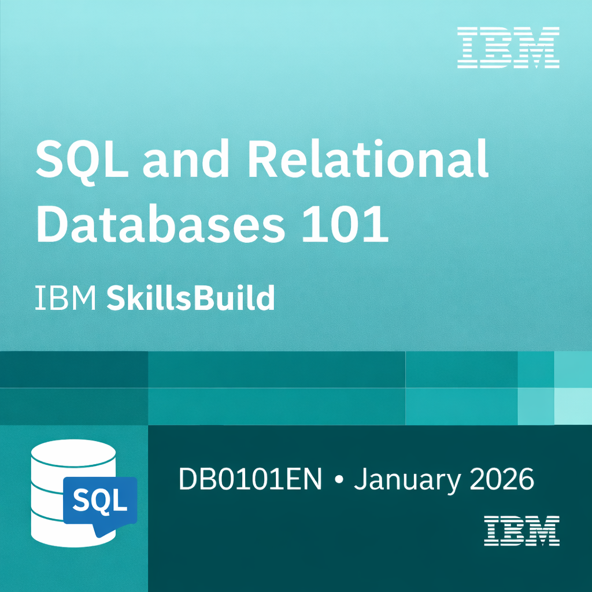

# 👋 Hi!

**Fullstack developer in training (Holberton School)**  
I build practical tools for real-world operations: scheduling, communication, and daily execution.

---

## 🎯 Goal
Looking for an **internship / apprenticeship** in **fullstack web development** (Rennes or remote).

---

## 🧩 Skills

  
<b>Next up (learning soon)</b>

  

---

## 📈 Language distribution

  

---

## 🚀 Currently
- Building: **C / Python projects** (CLI tools, algorithms, fundamentals)
- Learning: **Web stack** (HTML / CSS / JS → React / Node)
- Open to: **internship / apprenticeship** (Rennes or remote)

---

## 🧠 What I bring
Former retail manager focused on **team efficiency and field operations**.  
I approach development with a **pragmatic, structured, and result-oriented mindset**.

---

## 🏅 Certifications

  
  &nbsp;&nbsp;
  
  &nbsp;&nbsp;
  

---

## 📌 Featured projects

### 🧠 Systems in C
Low-level projects focused on memory management, processes, and core Unix concepts.

**Simple Shell** *(group project)*  
- Stack: C, POSIX, Unix  
- Demonstrates: parsing, process creation, memory discipline  
- Repo: https://github.com/Antgst/holbertonschool-simple_shell

**_printf** *(group project)*  
- Stack: C  
- Demonstrates: variadic functions, format parsing, low-level output  
- Repo: https://github.com/Antgst/holbertonschool-printf

**Sorting algorithms & Big O** *(group project)*  
- Stack: C  
- Demonstrates: algorithmic thinking, complexity analysis  
- Repo: https://github.com/Antgst/holbertonschool-sorting_algorithms

---

### 🐍 Python

**Higher level programming**  
- Stack: Python  
- Demonstrates: data structures, OOP basics, clean code  
- Repo: https://github.com/Antgst/holbertonschool-higher_level_programming

**ChatGPT Introduction**  
- Stack: Python  
- Demonstrates: debugging, explanation, documentation  
- Repo: https://github.com/Antgst/holbertonschool-chatgpt-introduction

---

### 🛠️ Shell & tooling

**Shell basics**  
- Stack: Bash  
- Repo: https://github.com/Antgst/holbertonschool-shell

**Git intro**  
- Stack: Git  
- Repo: https://github.com/Antgst/git-intro

---

## 🔗 Links

  
  
  
  

---

## 📈 Metrics

  

---

## 📊 GitHub stats

  
  

---

## 🏃‍♂️ Activity

