# 👋 Hi!

I'm transitioning into fullstack web development.  
I build projects focused on real-world needs, organization, and efficiency.

## 🎯 Goal
Looking for an internship / apprenticeship in fullstack web development (Rennes or remote).

## 🚀 Currently
- C / fundamentals
- Git / Linux
- Holberton projects

## 🧠 What I bring
Former retail manager focused on team efficiency and field operations.  
I aim to build tools that simplify scheduling, communication, and daily execution.

## 🛠️ Tools & 🧰 Stack

## 📌 Featured projects
- [Holberton - "_printf Project"](https://github.com/Antgst/holbertonschool-printf)
- [Holberton - C programming](https://github.com/Antgst/holbertonschool-low_level_programming)
- [Holberton - Shell Programming](https://github.com/Antgst/holbertonschool-shell)
- [Holberton - Git Programming](https://github.com/Antgst/git-intro)

## 🔗 Links

## 📈 Metrics

## 🏃‍♂️ Activity

## 📊 Stats

