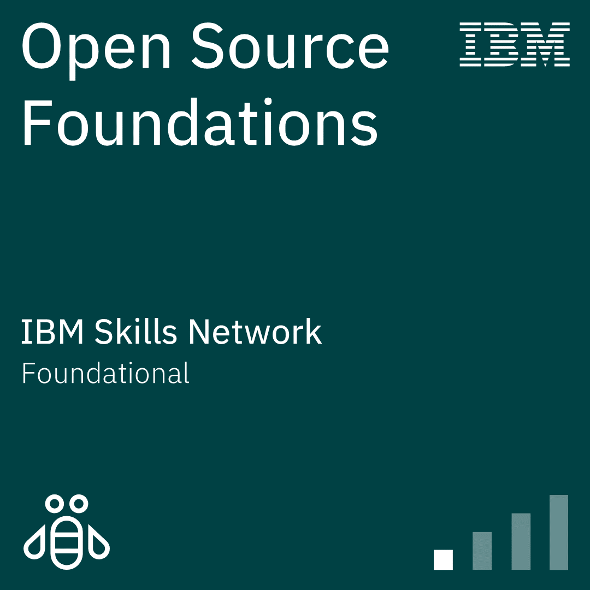
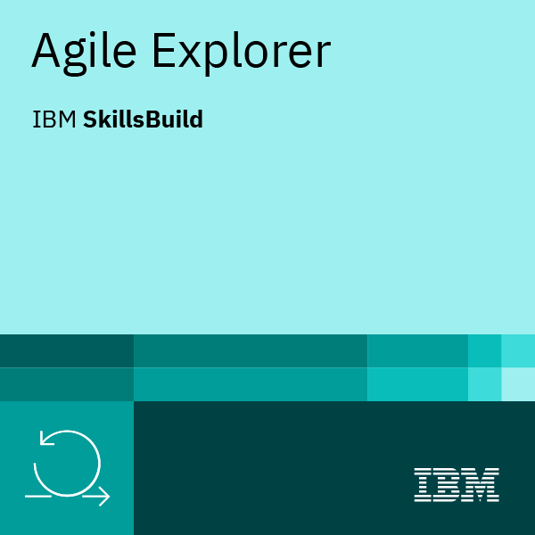
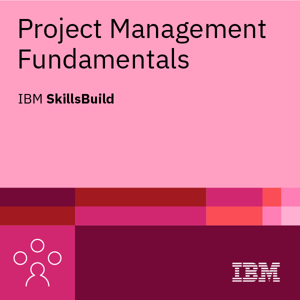
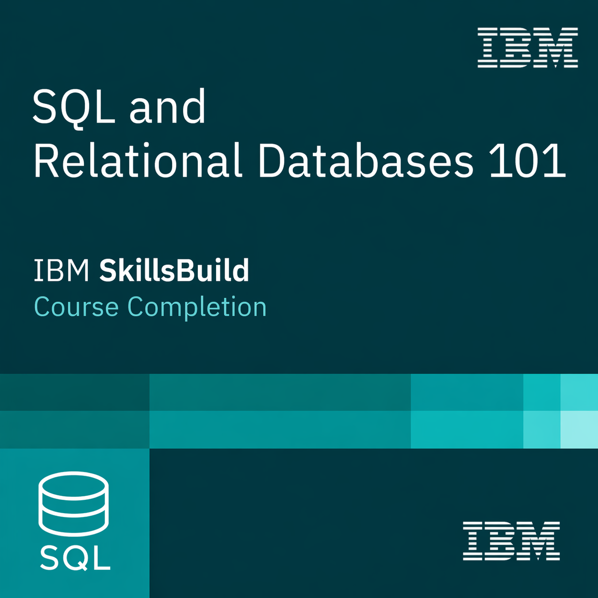

  

# Full-Stack Developer in Training

Former retail manager leading 50+ team members, now transitioning into software engineering at **Holberton School Rennes**.  
Building structured, scalable web applications with a strong focus on **Python, Flask, SQL, JavaScript, and clean architecture**.

**Currently seeking an internship / apprenticeship in full-stack web development (Rennes or remote).**

  <a href="https://github.com/Antgst/holbertonschool-hbnb">HBnB Project</a> •
  <a href="https://github.com/Antgst/CV">CV</a> •
  <a href="https://www.linkedin.com/in/antoinegousset">LinkedIn</a> •
  <a href="mailto:ant.gousset@gmail.com">Email</a>

---

# 🚀 Highlight Project

## 🏗 HBnB Evolution *(group project)*
**Python • Flask • REST API • JWT • SQLAlchemy • HTML • CSS • JavaScript • SQLite**

- Built and integrated key front-end pages connected to a REST API
- Implemented authentication-aware UI behavior and dynamic content rendering
- Contributed to a layered backend architecture with clear separation of concerns
- Worked on place pages, host cards, amenities, galleries, and reviews
- Participated in API validation through an exhaustive Postman suite (**142 tests passing**)

👉 [View the HBnB project](https://github.com/Antgst/holbertonschool-hbnb)

---

# 🧠 Core Focus

🔭 **Currently working on**  
Low-level systems programming in C, backend architecture foundations in Python, and full-stack web integration through the HBnB project.

🌱 **Currently learning**  
Advanced OOP, clean architecture principles, RESTful services, database modeling, and progressive front-end to back-end integration.

🎯 **Current objective**  
Secure an internship / apprenticeship in full-stack web development and continue building production-oriented technical skills.

---

# 💻 Technical Foundations

**Also practiced:**  
- RESTful API design with Flask / Flask-RESTX  
- JWT authentication and access control  
- SQLAlchemy / SQLite persistence  
- Front-end integration with vanilla JavaScript  
- API testing and validation with Postman  

<b>Next (in progress)</b>

 

---

# 📂 Systems & Programming Projects

<b>🖥 Systems Programming (C)</b>

 

**Low Level Programming** – foundational C concepts, memory management, pointers, functions, and file handling  
👉 [View repository](https://github.com/Antgst/holbertonschool-low_level_programming)

**Simple Shell** – process handling, parsing, and memory discipline  
👉 [View repository](https://github.com/Antgst/holbertonschool-simple_shell)

**_printf** – variadic functions and format parsing  
👉 [View repository](https://github.com/Antgst/holbertonschool-printf)

**Sorting Algorithms & Big O** – algorithmic complexity and sorting strategies  
👉 [View repository](https://github.com/Antgst/holbertonschool-sorting_algorithms)

**Binary Trees** – tree structures, traversals, and recursive logic  
👉 [View repository](https://github.com/Antgst/holbertonschool-binary_trees)

<b>🐍 Python & Web</b>

 

**HBnB Evolution** – layered API architecture, JWT authentication, persistence, front-end integration, and testing  
👉 [View repository](https://github.com/Antgst/holbertonschool-hbnb)

**Higher Level Programming** – Python data structures, OOP, abstraction, and problem solving  
👉 [View repository](https://github.com/Antgst/holbertonschool-higher_level_programming)

**ChatGPT Introduction** – debugging, prompting, and structured technical documentation  
👉 [View repository](https://github.com/Antgst/holbertonschool-chatgpt-introduction)

<b>🛠 Shell & Tooling</b>

 

**Shell Basics** – command line fundamentals, navigation, permissions, and scripting basics  
👉 [View repository](https://github.com/Antgst/holbertonschool-shell)

**Git Intro** – version control fundamentals and collaborative workflow basics  
👉 [View repository](https://github.com/Antgst/git-intro)

---

# 🏅 Certifications

<b>View certifications</b>

 

  
  &nbsp;&nbsp;
  
  &nbsp;&nbsp;
  
  &nbsp;&nbsp;
  

---

# 📈 GitHub

<b>Stats & Activity</b>

 

  
  

---

# 🌐 Contact

  
  
  
  

- Email: [ant.gousset@gmail.com](mailto:ant.gousset@gmail.com)  
- LinkedIn: [linkedin.com/in/antoinegousset](https://www.linkedin.com/in/antoinegousset)  
- CV: [View my CV](https://github.com/Antgst/CV)  
- Optional 20-minute call: [Book here](https://calendar.app.google/U6Q94Svp3Wt1fEj26)

