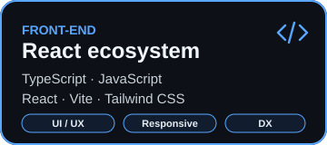
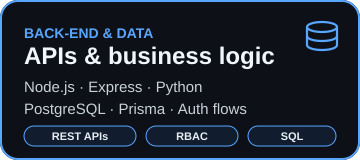
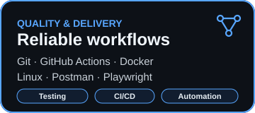
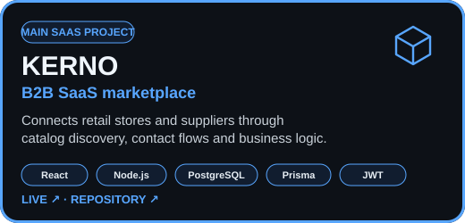
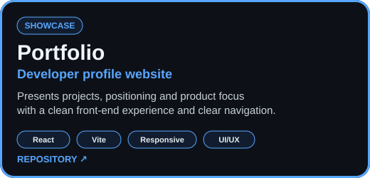

<h1 align="center">Antoine Gousset</h1>

  <strong>Full-Stack Developer · SaaS Builder</strong> 
  Product-minded developer building web products, APIs and automation.

  
  
  

 

## Core stack

  
  
  

  REST APIs · Authentication · Testing · CI/CD · Code review · Automation · AI-assisted development

 

## Featured projects

  
  

  
  
  

 

---

<strong>🇫🇷 À propos — profil, expérience et façon de travailler</strong>

 

### Développeur full-stack · SaaS builder · approche produit

Je construis des applications et produits web à partir de **besoins métier concrets**, avec une attention particulière portée à la maintenabilité, aux tests et à la fiabilité de la livraison.

Je contribue actuellement dans un **environnement full-stack professionnel chez Okwind**, sur une codebase existante avec tickets, revues de code, tests, pipelines et plusieurs environnements de livraison.

En parallèle, je conçois et fais évoluer des **produits SaaS, outils internes et automatisations**, avec un intérêt particulier pour l'utilisation pragmatique de l'IA et des agents dans les workflows de développement.

#### Ce que je construis

- **SaaS et produits B2B** avec de vrais parcours utilisateurs et règles métier
- **Applications full-stack** de l'interface à l'API et à la base de données
- **Workflows fiables** avec tests, CI/CD, code review et documentation
- **Automatisations et outils développeur** qui réduisent les tâches répétitives

#### KERNO

KERNO est une marketplace SaaS B2B conçue autour d'un problème que je connais directement par mon expérience en grande distribution : faciliter la découverte de fournisseurs, l'exploration de catalogues et la prise de contact qualifiée entre magasins et fournisseurs.

Le projet couvre notamment l'authentification par rôles, les API REST, PostgreSQL/Prisma, les interfaces responsives, les tests API/E2E et GitHub Actions.

#### Ma façon de travailler

**Comprendre → suivre le flux existant → modifier le minimum nécessaire → relire → tester → intégrer → documenter.**

L'objectif n'est pas seulement qu'une fonctionnalité fonctionne, mais qu'elle reste **compréhensible, testable et maintenable**.

#### Culture produit & métier

Avant le développement logiciel, j'ai passé **18 ans dans la grande distribution**, jusqu'au poste de directeur adjoint avec management d'équipes de plus de 50 personnes.

Cette expérience influence encore ma manière de développer : je regarde naturellement les workflows, les contraintes opérationnelles, l'adoption, la priorisation et la valeur réellement apportée à l'utilisateur.

**Direction actuelle : Full-Stack Engineering × SaaS × Product Thinking × Automation × Applied AI**

 

<strong>🇬🇧 About — profile, experience and engineering approach</strong>

 

### Full-Stack Developer · SaaS Builder · Product-minded

I build web applications and products from **real business needs**, with a strong focus on maintainability, testing and reliable delivery.

I currently contribute in a **professional full-stack environment at Okwind**, working with an existing codebase, tickets, code reviews, tests, delivery pipelines and multiple environments.

Alongside professional development, I design and iterate on **SaaS products, internal tools and automation-oriented projects**, with a particular interest in pragmatic uses of AI and agents inside engineering workflows.

#### What I build

- **SaaS and B2B products** with real user journeys and business rules
- **Full-stack applications** from interface to API and database
- **Reliable workflows** with testing, CI/CD, code review and documentation
- **Developer tooling and automation** that remove repetitive work

#### KERNO

KERNO is a B2B SaaS marketplace built around a retail problem I know first-hand: making it easier for stores to discover suppliers, explore catalogues and start qualified business conversations.

The project covers role-based authentication, REST APIs, PostgreSQL/Prisma, responsive interfaces, API/E2E testing and GitHub Actions.

#### How I work

**Understand → trace the existing flow → make the smallest coherent change → review → test → integrate → document.**

The goal is not simply to make a feature work once, but to make it **understandable, testable and maintainable**.

#### Product & business background

Before moving into software development, I spent **18 years in retail**, progressing to deputy store director and managing teams of more than 50 people.

That experience still shapes the way I build software: I naturally look at workflows, operational constraints, adoption, prioritisation and the real value delivered to users.

**Current direction: Full-Stack Engineering × SaaS × Product Thinking × Automation × Applied AI**

 

<strong>🎓 Engineering foundations / Fondamentaux</strong>

 

My software engineering foundations were built through intensive project-based work at **Holberton School Rennes**, covering C, Python, shell, algorithms, data structures, APIs, databases and full-stack development.

Mes fondamentaux ont été construits à travers une formation intensive par projets à **Holberton School Rennes**, couvrant notamment C, Python, shell, algorithmique, structures de données, API, bases de données et développement full-stack.

Selected foundation project: [HBnB Evolution](https://github.com/Antgst-Holberton/holbertonschool-hbnb) — Flask REST API, JWT, SQLAlchemy, JavaScript and API validation.

 

<strong>📊 GitHub activity</strong>

 

  
  

  

 

---

  <a href="https://www.linkedin.com/in/antoinegousset">LinkedIn</a> ·
  <a href="https://github.com/Antgst/Antgst.github.io">Portfolio</a> ·
  <a href="https://github.com/Antgst/Kerno-MVP">KERNO</a> ·
  <a href="mailto:ant.gousset@gmail.com">Email</a>

