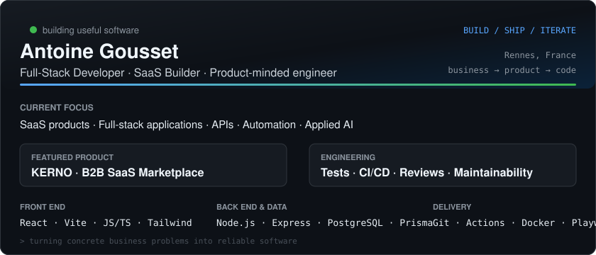

  

  <a href="https://www.linkedin.com/in/antoinegousset"><strong>LinkedIn</strong></a>
  &nbsp;•&nbsp;
  <a href="https://github.com/Antgst/Antgst.github.io"><strong>Portfolio</strong></a>
  &nbsp;•&nbsp;
  <a href="https://github.com/Antgst/Kerno-MVP"><strong>KERNO</strong></a>
  &nbsp;•&nbsp;
  <a href="mailto:ant.gousset@gmail.com"><strong>Email</strong></a>

 

## 🧰 Stack principale / Core stack

  <strong>Front-end</strong>  
  

  <strong>Back-end & Data</strong>  
  

  <strong>Quality, Delivery & Tooling</strong>  
  

  
  
  
  
  
  

 

---

<h2>🇫🇷 Français</h2>

 

### Développeur full-stack · SaaS builder · approche produit

Je construis des applications et produits web à partir de **besoins métier concrets**, avec une attention particulière portée à la maintenabilité, aux tests et à la fiabilité de la livraison.

Je contribue actuellement dans un **environnement full-stack professionnel chez Okwind**, sur une codebase existante avec tickets, revues de code, tests, pipelines et différents environnements de livraison.

En parallèle, je conçois et fais évoluer des **produits SaaS, outils internes et automatisations**, avec un intérêt particulier pour l'utilisation pragmatique de l'IA et des agents dans les workflows de développement.

 

### Ce que je construis

- **SaaS et produits B2B** avec de vrais parcours utilisateurs et règles métier
- **Applications full-stack** de l'interface jusqu'à l'API et la base de données
- **Workflows fiables** avec tests, CI/CD, code review et documentation
- **Automatisations et outils développeur** pour réduire les tâches répétitives

 

### 🚀 Projet phare — KERNO

> **Marketplace SaaS B2B pour la grande distribution**  
> React · Vite · Node.js · Express · PostgreSQL · Prisma · JWT · Tailwind CSS

[**KERNO**](https://github.com/Antgst/Kerno-MVP) part d'un problème métier que je connais bien : faciliter la découverte de fournisseurs, l'exploration de catalogues et la prise de contact qualifiée entre magasins et fournisseurs.

Le projet couvre l'authentification par rôles, les API REST, la modélisation PostgreSQL, les migrations Prisma, les interfaces responsives, les tests API/E2E et les workflows GitHub Actions.

  
  

 

### Ma façon de travailler

**Comprendre → suivre le flux → modifier le minimum nécessaire → relire → tester → intégrer → documenter.**

L'objectif n'est pas seulement qu'une fonctionnalité fonctionne, mais qu'elle reste **compréhensible, testable et maintenable**.

 

### Culture produit & métier

Avant le développement logiciel, j'ai passé **18 ans dans la grande distribution**, jusqu'au poste de directeur adjoint avec management d'équipes de plus de 50 personnes.

Cette expérience influence ma manière de développer : je regarde naturellement les workflows, les contraintes opérationnelles, l'adoption, la priorisation et la valeur réellement apportée à l'utilisateur.

<strong>Full-Stack Engineering × SaaS × Product Thinking × Automation × Applied AI</strong>

---

<h2>🇬🇧 English</h2>

 

### Full-Stack Developer · SaaS Builder · Product-minded

I build web applications and products from **real business needs**, with a strong focus on maintainability, testing and reliable delivery.

I currently contribute in a **professional full-stack environment at Okwind**, working with an existing codebase, tickets, code reviews, tests, delivery pipelines and multiple environments.

Alongside professional development, I design and iterate on **SaaS products, internal tools and automation-oriented projects**, with a particular interest in pragmatic uses of AI and agents inside engineering workflows.

 

### What I build

- **SaaS and B2B products** with real user journeys and business rules
- **Full-stack applications** from interface to API and database
- **Reliable workflows** with testing, CI/CD, code review and documentation
- **Developer tooling and automation** that remove repetitive work

 

### 🚀 Featured product — KERNO

> **B2B SaaS marketplace for the retail industry**  
> React · Vite · Node.js · Express · PostgreSQL · Prisma · JWT · Tailwind CSS

[**KERNO**](https://github.com/Antgst/Kerno-MVP) is built around a retail problem I know first-hand: making it easier for stores to discover suppliers, explore catalogues and start qualified business conversations.

The project covers role-based authentication, REST APIs, PostgreSQL modelling, Prisma migrations, responsive interfaces, API/E2E testing and GitHub Actions workflows.

  
  

 

### How I work

**Understand → trace the flow → make the smallest coherent change → review → test → integrate → document.**

The goal is not simply to make a feature work once, but to make it **understandable, testable and maintainable**.

 

### Product & business background

Before moving into software development, I spent **18 years in retail**, progressing to deputy store director and managing teams of more than 50 people.

That experience still shapes the way I build software: I naturally look at workflows, operational constraints, adoption, prioritisation and the real value delivered to users.

<strong>Full-Stack Engineering × SaaS × Product Thinking × Automation × Applied AI</strong>

---

<b>🎓 Software engineering foundations / Fondamentaux</b>

 

My software engineering foundations were built through intensive project-based work at **Holberton School Rennes**, covering C, Python, shell, algorithms, data structures, APIs, databases and full-stack development.

Mes fondamentaux ont été construits à travers une formation intensive par projets à **Holberton School Rennes**, couvrant notamment C, Python, shell, algorithmique, structures de données, API, bases de données et développement full-stack.

 

## 📊 GitHub activity

  

 

  <a href="https://www.linkedin.com/in/antoinegousset">LinkedIn</a> •
  <a href="https://github.com/Antgst/Antgst.github.io">Portfolio</a> •
  <a href="mailto:ant.gousset@gmail.com">Email</a>

  

